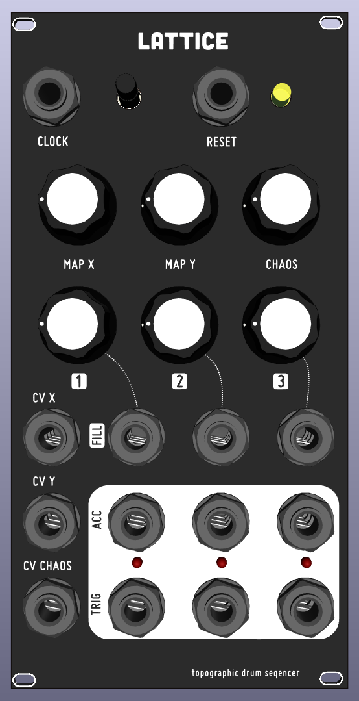
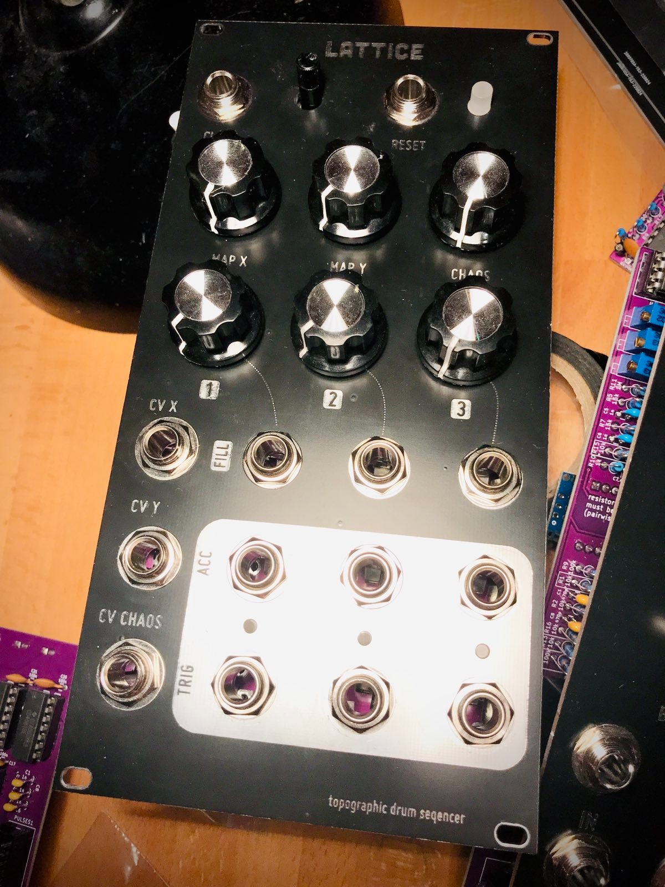

## KOSMO format adoption from Mutable Instruments Grids

Using the Schematic of Mutable Instruments and initial Kicad files by www.quinie.nl

I had to fix the pot direction and the button but now it works!
For the firmware I have added the compiled firmware (`grids.hex`) and a script on how to upload it to your nano (`upload.sh`, you need to adjust the paths)

